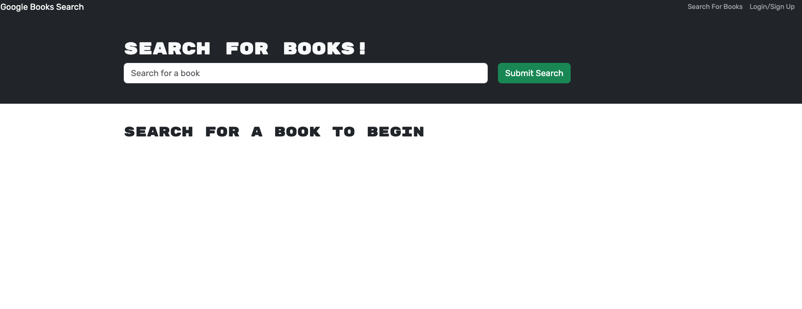
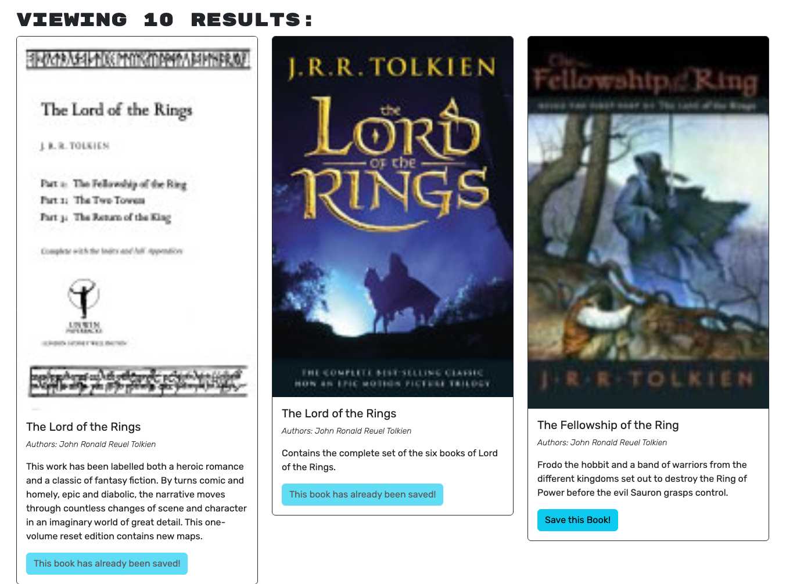
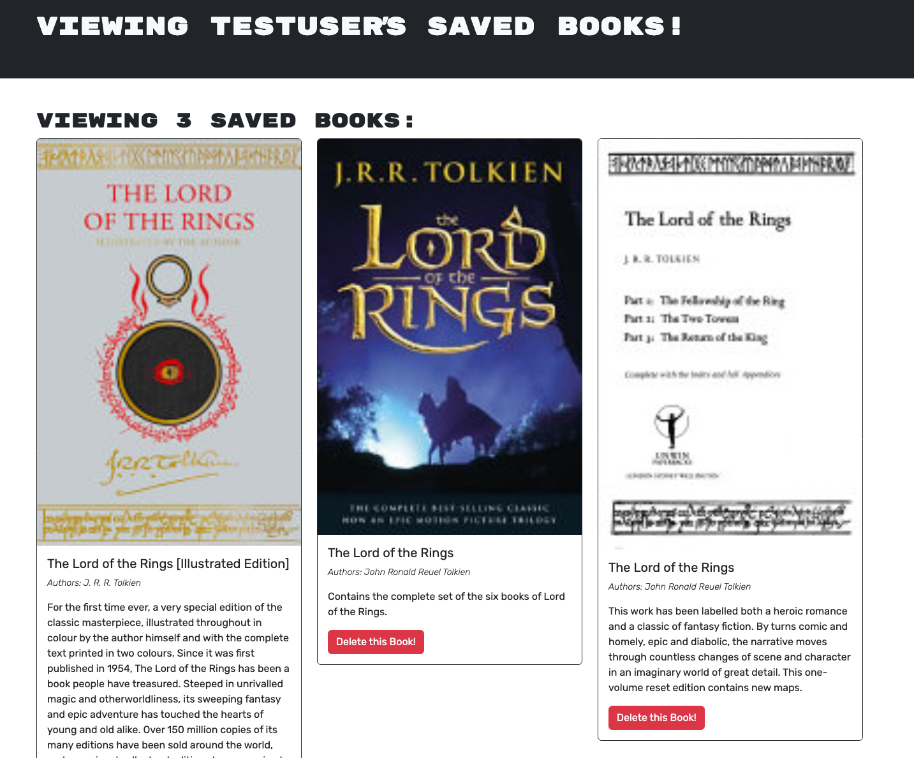

# Google Book Search

## Table of Contents
- [Descriptionn](#description)
- [Installation Instructions](#installation-instructions)
- [How to Use the App](#how-to-use-the-app)
- [Contribution Guidelines](#contribution-guidelines)
- [Test Instrustions](#test-instructions)
- [Questions](#questions)

## Description
- This project demonstrates the ability to convert a RESTful API app to a MERN stack app
- The original app was provided by the UNC Coding Bootcamp. It allows the user to search for books using the Google Books API. When the user is logged in, they can save the books to their list, and also delete them from their list
- This existing application was converted to the MERN stack. It uses Apollo Server and GraphQl. 

## Installation Instructions
- All required packages are included in the repository. Install all packages using the command "npm install" at the root. 
- The application can be built using the command "npm run build". No seeding is required. 
- To test the application in development run the command "npm run start:dev"
- For deploying on render, use the "npm run render-build" for the build command, and the "npm run server" command for the start command
- Do not forget to modify the .env.EXAMPLE file to include your database name if running locally. If deploying on render, make sure that the connection link is provided in the environmenal variable MODNGODB_URI
- You must also provide a value for the JWT_SECRET_KEY variable in the .env.EXAMPLE file. Similar to the database connection, an environmentable variable JWT_SECRET_KEY variable must be entered in Render
- Do not forget to remove the .EXAMPLE suffix for the .env file. This can be done quickly from within the server directory by entering the command cp .env{.example,} in the terminal/command line

## How to Use the App
- To use the app, navigate to the relevant URL (localhost:3000 on when running locally). You may search for books on the homepage
- If you sign-up (and afterwards, once you logout, if y ou log back in again), you can save the searched books to your list of saved books
- You are also able to delete books from your saved book list

## Contribution Guidelines
- Original code provided by the UNC Coding Bootcamp. Conversion to the MERN stack provides by Jan Krajniak

## Test Instructions
- N/A

## Questions
- My GitHub username: jankrajniak
- My email address: jan.krajniak@gmail.com
- Additional instructions on how to contact me:
  - If you wish to contact me, you may do so at the above email.

## License
- This project is licensed under the MIT license: 

## Link to the deployed website
https://booksearch-n3yu.onrender.com/

## Screenshots

